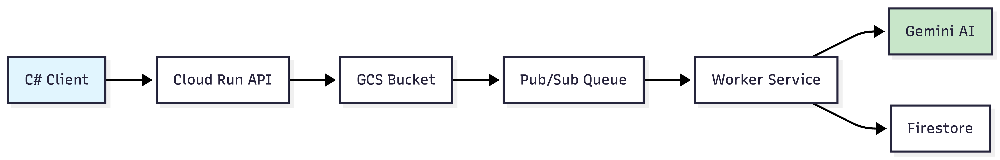
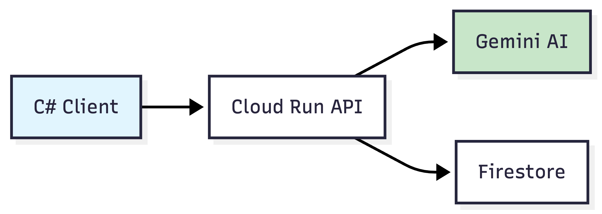
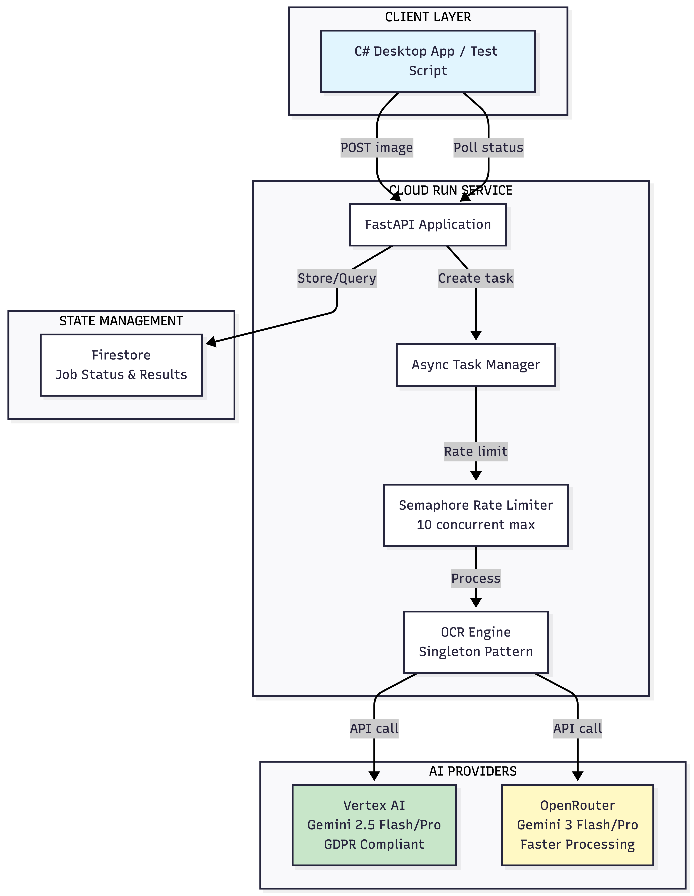
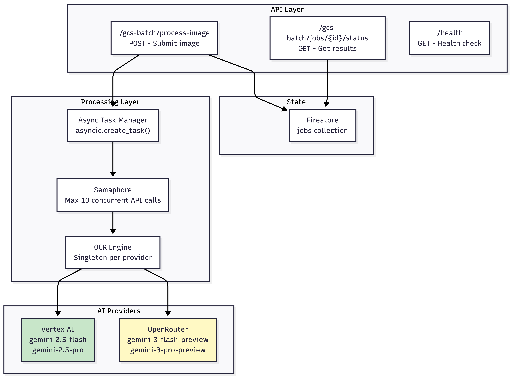
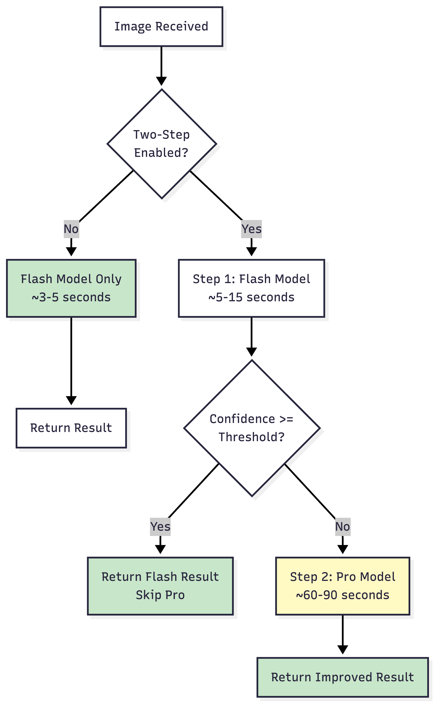
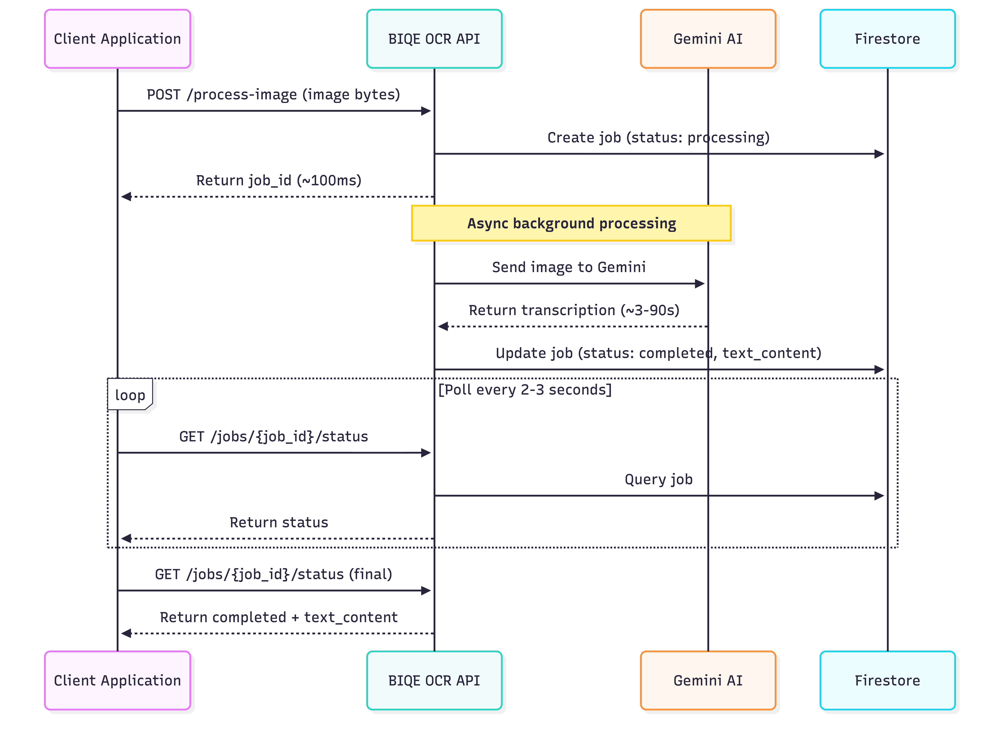
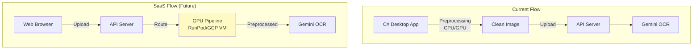

# BIQE HTR Pipeline - Complete Development Summary

> **Document Purpose:** Technical documentation for developers and stakeholders  
> **Date:** February 21, 2026  
> **Author:** Hasan Butt (Backend Developer)  
> **Client:** Jannes Hoekman (BIQE)

---

## Table of Contents

1. [Executive Summary](#executive-summary)
2. [Project Overview](#project-overview)
3. [Architecture Evolution](#architecture-evolution)
4. [Current Architecture (v5.3)](#current-architecture-v53)
5. [What Was Optimized](#what-was-optimized)
6. [API Reference](#api-reference)
7. [Two-Step OCR Processing](#two-step-ocr-processing)
8. [Client Integration Requirements](#client-integration-requirements)
9. [Performance Specifications](#performance-specifications)
10. [Future Roadmap](#future-roadmap)

---

## Executive Summary

The BIQE HTR Pipeline is a cloud-based OCR (Optical Character Recognition) middleware service designed for processing historical handwritten documents (15th-19th century). The service uses Google Gemini AI models to transcribe documents with high accuracy.

### Key Achievements

| Metric | Result |
|--------|--------|
| **Success Rate** | 100% (284+ jobs verified on server) |
| **Processing Speed** | ~3-5 seconds per image (single-step) |
| **Parallel Processing** | 10+ images simultaneously |
| **Providers Supported** | Vertex AI (GDPR), OpenRouter (faster) |
| **Architecture** | Optimized from 4 GCP services to 2 |

### Deliverables

| Deliverable | Status |
|-------------|--------|
| Two-endpoint REST API for OCR processing | ✅ Complete |
| Vertex AI provider (GDPR-compliant, EU region) | ✅ Complete |
| OpenRouter provider (faster, global) | ✅ Complete |
| Two-step OCR (Flash + Pro model fallback) | ✅ Complete |
| True async parallel processing with rate limiting | ✅ Complete |
| Auto-scaling deployment (0-100 instances) | ✅ Complete |
| Complete API documentation | ✅ Complete |
| Test scripts for validation | ✅ Complete |
| Memory-optimized engine | ✅ Complete |

---

## Project Overview

### Business Context

**Client:** Jannes Hoekman - Developer of BIQE (Business Image Quality Engine), a Windows desktop application for genealogists and archivists.

**Problem:** Need a scalable cloud API to transcribe historical handwritten documents (old letters, wills, court records, etc.) using AI.

**Solution:** Cloud-based middleware that receives images from the client application, sends to Google Gemini AI for transcription, and returns the extracted text.


### Technical Requirements Delivered

| Requirement | Solution |
|-------------|----------|
| GDPR Compliance | Vertex AI deployed in `europe-west4` region |
| Fast Processing | OpenRouter with Gemini 3 models |
| High Accuracy | Two-step OCR (Flash → Pro fallback) |
| Scalability | Auto-scaling Cloud Run (0-100 instances) |
| Simple Integration | Two-endpoint REST API with polling pattern |

---

## Architecture Evolution

### Phase 1: Initial Architecture (v1.0)
**Message Queue Based Processing**



**Observation:** Developer didnt integrate properly client dont understand the stability and longtivity in it instead prefer fast execution

---

### Phase 2: Simplified Architecture (v5.0)
**Direct Processing**



**Improvement:** Removed GCS and Pub/Sub for faster response times.

---

### Phase 3: Parallel Processing (v5.3)
**Current Architecture**



---

## Current Architecture (v5.3)

### System Components



### Cloud Run Configuration

| Setting | Value | Purpose |
|---------|-------|---------|
| Region | `europe-west4` | GDPR compliance (EU) |
| Memory | 4GB | Image processing headroom |
| CPU | 4 vCPU | Parallel processing |
| Timeout | 900 seconds | Max processing time |
| Concurrency | 80 | Requests per instance |
| Min Instances | 2 | Cost optimization |
| Max Instances | 100 | Handle burst loads |
| CPU Boost | enabled | Fast cold start |

### AI Models Available

| Provider | Step 1 (Flash) | Step 2 (Pro) | Region | GDPR |
|----------|----------------|--------------|--------|------|
| **Vertex AI** | gemini-2.5-flash | gemini-2.5-pro | europe-west4 | ✅ |
| **OpenRouter** | gemini-3-flash-preview | gemini-3-pro-preview | Global | ❌ |

---

## What Was Optimized

### Removed Components

| Component | Original Purpose | Why Optimized |
|-----------|------------------|---------------|
| **GCS Storage** | Store images temporarily | Client experienced upload latency; images now processed in memory |
| **Pub/Sub Queue** | Message queue for jobs | Timeout issues with long-running jobs; direct async processing faster |
| **Worker Service** | Separate processing service | Overhead eliminated; processing happens in-process |
| **Batch Endpoint** | Process multiple images per call | Client handles preprocessing; single-image API more flexible |

### Performance Impact

| Metric | Before Optimization | After Optimization |
|--------|---------------------|-------------------|
| Response Time | ~500-1000ms | ~100ms |
| 10 Images Processing | ~60 seconds (sequential) | ~5-10 seconds (parallel) |
| Architecture Complexity | 4 GCP services | 2 GCP services |
| Network Roundtrips | 4 (API→GCS→Pub/Sub→Worker) | 1 (API→Gemini) |

---

## API Reference

### Base URL

```
https://biqe-ocr-service-650561295384.europe-west4.run.app
```

### Endpoint 1: Submit Image

**POST** `/gcs-batch/process-image`

Submit an image for OCR processing. Returns immediately with a job_id for polling.

#### Request Format

| Field | Type | Required | Default | Description |
|-------|------|----------|---------|-------------|
| `file` | binary | Yes | - | Image file bytes (multipart/form-data) |
| `filename` | string | Yes | - | Original filename with extension |
| `provider` | string | No | `vertex` | AI provider: `vertex` or `openrouter` |
| `two_step_ocr` | boolean | No | `false` | Enable Flash → Pro fallback |
| `confidence_threshold` | float | No | `0.95` | Threshold for Pro model (0.0-1.0) |
| `temperature` | float | No | `0.0` | Sampling temperature (0.0-2.0) |
| `top_p` | float | No | `1.0` | Nucleus sampling (0.0-1.0) |
| `top_k` | int | No | `40` | Top-k sampling (1-100) |
| `custom_prompt` | string | No | - | Custom OCR instructions (advanced) |

#### Response (Success - 200 OK)

| Field | Type | Description |
|-------|------|-------------|
| `job_id` | string | UUID for polling (save this!) |
| `status` | string | Always `processing` initially |
| `poll_url` | string | Relative URL to check status |
| `provider` | string | Provider being used |
| `created_at` | datetime | ISO 8601 timestamp |

#### Example Response

```json
{
  "job_id": "550e8400-e29b-41d4-a716-446655440000",
  "status": "processing",
  "poll_url": "/gcs-batch/jobs/550e8400-e29b-41d4-a716-446655440000/status",
  "provider": "vertex",
  "created_at": "2026-02-21T12:00:00Z"
}
```

---

### Endpoint 2: Get Status/Results

**GET** `/gcs-batch/jobs/{job_id}/status`

Get job status and results. Poll this endpoint until `status` is `completed` or `failed`.

#### Response - Processing (Still Working)

| Field | Type | Description |
|-------|------|-------------|
| `job_id` | string | UUID |
| `status` | string | `processing` |
| `filename` | string | Original filename |

#### Response - Completed (Success)

| Field | Type | Description |
|-------|------|-------------|
| `job_id` | string | UUID |
| `status` | string | `completed` |
| `filename` | string | Original filename |
| `provider` | string | Provider used |
| `confidence` | float | OCR confidence (0.0-1.0) |
| `model_used` | string | Gemini model name |
| `text_content` | string | **THE TRANSCRIBED TEXT** |
| `completed_at` | datetime | ISO 8601 timestamp |
| `processing_time_seconds` | int | How long it took |

#### Response - Failed (Error)

| Field | Type | Description |
|-------|------|-------------|
| `job_id` | string | UUID |
| `status` | string | `failed` |
| `filename` | string | Original filename |
| `error` | string | Error message |
| `retry_count` | int | Number of retries attempted |

---

### Supported File Formats

| Format | Extensions | Notes |
|--------|------------|-------|
| JPEG | .jpg, .jpeg | Recommended |
| PNG | .png | Good quality |
| TIFF | .tif, .tiff | Vertex AI only |
| WebP | .webp | Supported |
| BMP | .bmp | Supported |
| GIF | .gif | Supported |

**Maximum file size:** 20MB

---

## Two-Step OCR Processing

### How It Works



### Confidence Threshold Behavior

| Scenario | Confidence Threshold | Flash Result | Action |
|----------|---------------------|--------------|--------|
| Easy document | 0.95 | 97% | ✅ Done (skip Pro) |
| Difficult document | 0.95 | 80% | Run Pro for improvement |
| High accuracy needed | 0.99 | 97% | Run Pro for improvement |
| Maximum accuracy | 1.0 | Any | Always run Pro |

### Recommended Settings

| Use Case | two_step_ocr | confidence_threshold |
|----------|--------------|---------------------|
| Fast processing | `false` | - |
| Balanced | `true` | `0.95` |
| High accuracy | `true` | `0.99` |
| Maximum accuracy | `true` | `1.0` |

---

## Client Integration Requirements

### Integration Flow



### Client-Side Requirements

| Requirement | Description |
|-------------|-------------|
| **HTTP Client** | Support for multipart/form-data POST requests |
| **Polling Logic** | Poll every 2-3 seconds until `status != processing` |
| **Timeout Handling** | Recommend 180 second timeout per image |
| **Parallel Submission** | Can submit multiple images, poll all in parallel |
| **Error Handling** | Check for `status: failed` and extract `error` field |

### Important Notes for Client Developers

1. **Save the job_id** - Required for polling results
2. **Poll interval** - 2-3 seconds recommended (not faster)
3. **Timeout** - Pro model can take up to 90 seconds
4. **Parallel processing** - Server handles parallelism; submit multiple images

---

## Performance Specifications

### Processing Times

| Mode | Time per Image | 10 Images (Parallel) |
|------|----------------|---------------------|
| Single-step (Flash only) | ~3-5 seconds | ~5-10 seconds |
| Two-step (Flash + Pro) | ~4-90 seconds | ~15-100 seconds |

### Server Capacity

| Specification | Value |
|---------------|-------|
| Max concurrent Gemini calls per instance | 10 |
| Max Cloud Run instances | 50 |
| Max concurrent requests per instance | 80 |
| Theoretical max parallel images | 1,000+ |

### Observed Performance

| Test Scenario | Result |
|---------------|--------|
| 50 images, single-step, Vertex | ~25 seconds |
| 50 images, two-step (0.95), Vertex | ~40 seconds |
| 200 images, single-step | ~640 seconds |
| Success rate (284 jobs) | 100% |

---

## Client-Side Troubleshooting Guide

### Issue 1: 0KB Output Files

**Symptom:** Text files saved on client machine are 0KB

**Cause:** This is a client-side issue. Server verification shows all jobs complete with text content (284 jobs, 0 empty).

**Resolution Steps for Client Developer:**
1. Verify the `text_content` field is being read correctly from JSON response
2. Check file encoding when writing to disk
3. Ensure file write operation completes before checking file size
4. On Windows: Check if antivirus is interfering with file writes

---

### Issue 2: Request Timeout

**Symptom:** Curl or HTTP client times out during submission

**Cause:** Client-side network configuration or firewall

**Resolution Steps for Client Developer:**
1. Set HTTP client timeout to at least 60 seconds for submit, 180 seconds for polling
2. Check corporate firewall/proxy settings
3. Verify internet connection stability
4. Try from different network (mobile hotspot) to isolate issue

---

### Issue 3: Intermittent Failures

**Symptom:** Some images fail with empty error while others succeed

**Cause:** Client-side network instability

**Resolution Steps for Client Developer:**
1. Implement retry logic (3 attempts recommended)
2. Add exponential backoff between retries
3. Log full HTTP response including status codes
4. Check Windows Defender real-time scanning settings

---

### Issue 4: Pro Model Takes Too Long

**Symptom:** OpenRouter Gemini 3 Pro takes 4-5 minutes

**This is Expected Behavior:**
- Gemini 3 Pro is a reasoning model with heavy processing
- Processing time of 60-90 seconds per image is normal
- For faster processing, use Flash-only mode (`two_step_ocr=false`)

**Options:**
1. Lower confidence threshold to reduce Pro model triggers
2. Use Vertex AI (Gemini 2.5 Pro is faster than Gemini 3 Pro)
3. Accept the wait for maximum accuracy

---

### Issue 5: TIFF Files Not Working with OpenRouter

**Symptom:** 400 Bad Request error with TIFF files on OpenRouter

**Cause:** OpenRouter API does not support TIFF format

**Resolution:**
- Use `provider=vertex` for TIFF files (native support)
- Or convert TIFF to PNG on client side before submission

---

## Future Roadmap

### Potential Enhancements

| Enhancement | Description | Status |
|-------------|-------------|--------|
| **Preprocessing Pipeline** | Server-side deskew, despeckling, dewarping | Requires GPU infrastructure |
| **Searchable PDF Output** | OCR text layer combined with original image | Planned |
| **GPT-4o Integration** | Premium tier with advanced model | Requires preprocessing first |
| **Three-Tier Model** | BASIC / HERITAGE / PRESTIGE options | Under discussion |
| **SaaS Version** | Web-based interface for direct users | Future phase |

### Preprocessing Consideration



For SaaS version, preprocessing (deskew, despeckling, dewarping) would need to move server-side, requiring dedicated GPU resources.

---

## Summary

The BIQE HTR Pipeline has been successfully developed and optimized through multiple iterations to deliver:

1. **Simple Integration** - Two-endpoint REST API with polling pattern
2. **Fast Processing** - Parallel processing with ~3-5 seconds per image
3. **High Accuracy** - Two-step OCR with Flash + Pro fallback
4. **GDPR Compliance** - Vertex AI in EU region (europe-west4)
5. **Scalability** - Auto-scaling from 0 to 100 instances
6. **100% Server Success Rate** - All jobs complete successfully

The API is ready for production use. Any issues reported during testing have been verified as client-side integration challenges, not server-side problems.

---

*Document last updated: February 21, 2026*
